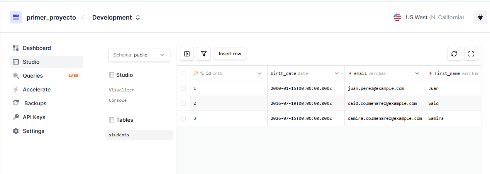
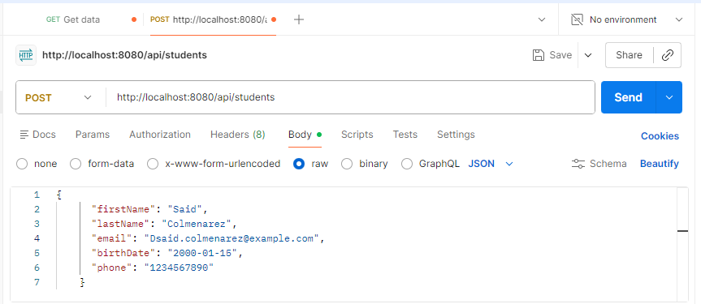
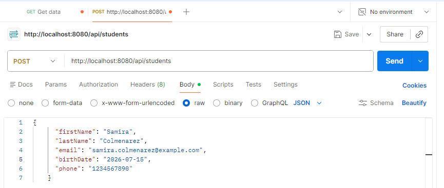
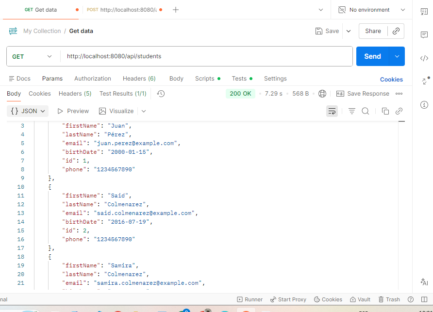
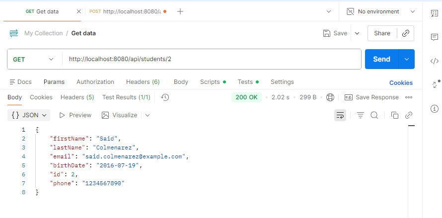
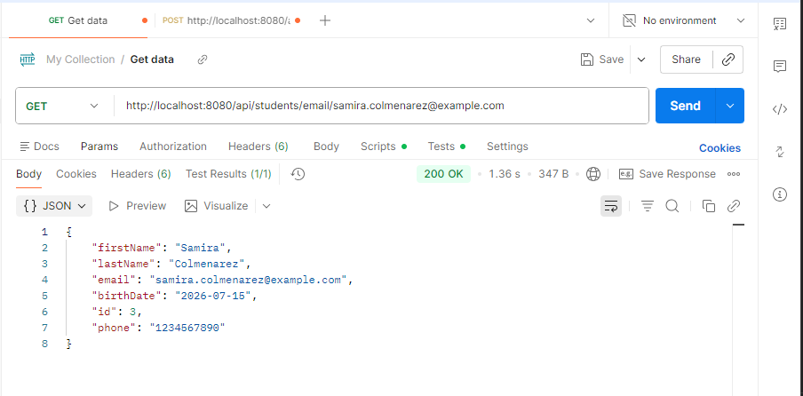
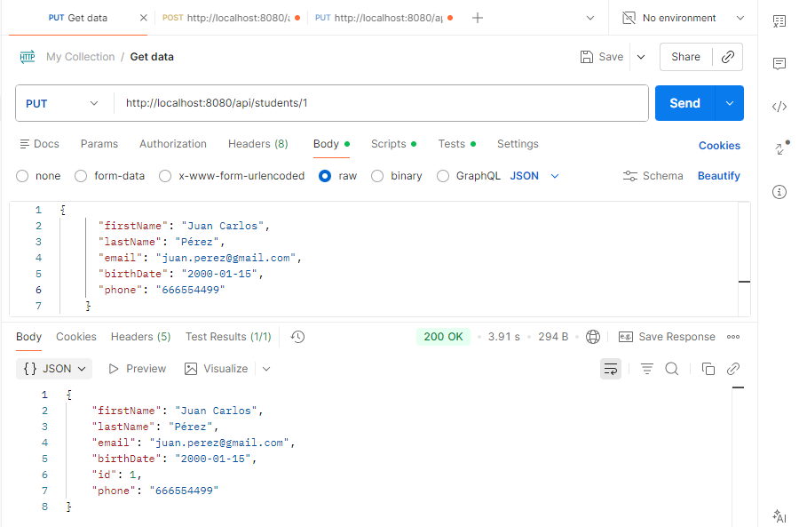
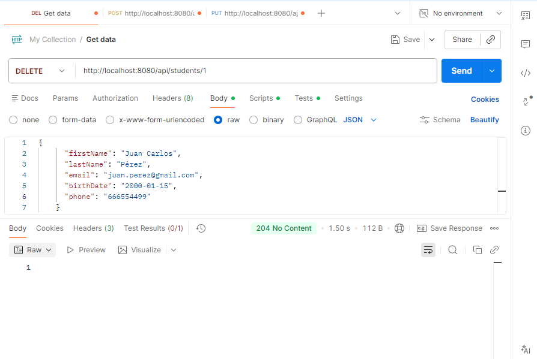
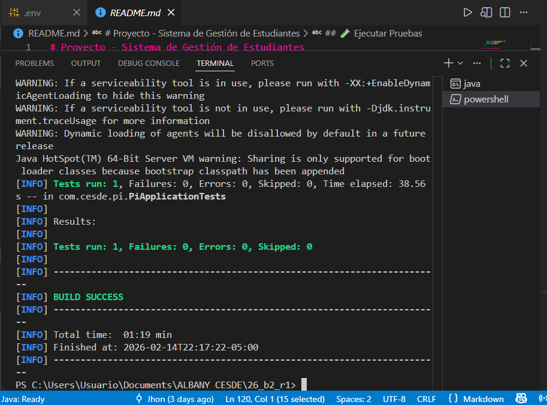

# Tarea 1 Backend 2

** Nombre Completo:** Albany Anmabel Luciani Mujica

## 1. Instancia de Base de Datos

- **Enlace a la instancia:** (https://console.prisma.io/cmlk3zaui02h4w8efulaq9bbp/cmlk411ai02awx7edkk3l5is7/cmlk411ai02aux7ed675iykue/studio)

* _Configuración de Base de Datos en Prisma.io:_
  

---

## 2. Conexión desde Spring Boot

---

## 3. Pruebas de la API (CRUD)

### [POST] Crear Registro

Captura de la solicitud (Request) y la respuesta (Response) en Postman/Insomnia:

### [GET] Obtener Todos (All)

### [GET] Obtener por ID

### [GET] Obtener por Email

### [PUT] Actualizar Registro

### [DELETE] Eliminar Registro

---

## 4. Pruebas Internas del Proyecto

> _Estado final:_ Todas las pruebas pasaron exitosamente.

---

Este repositorio es un fork del proyecto original para la asignatura de Backend 2.---
